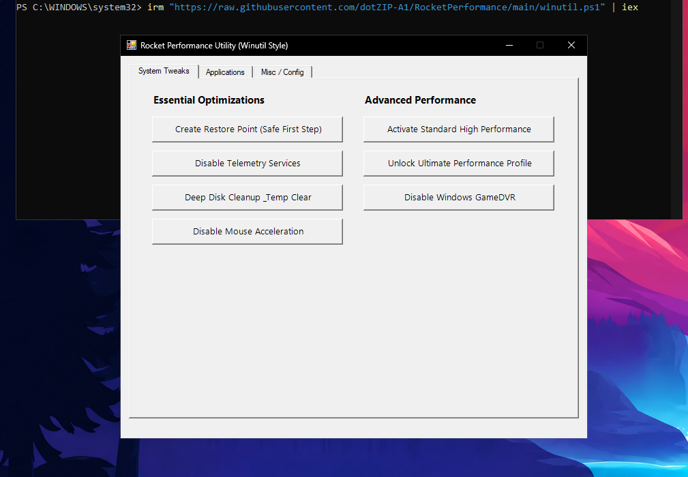
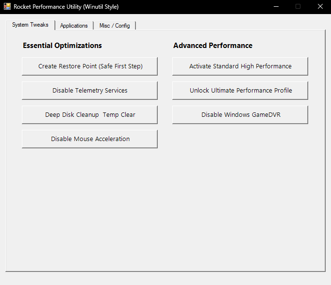
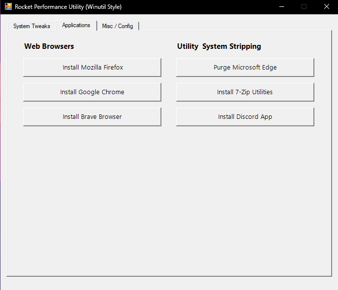
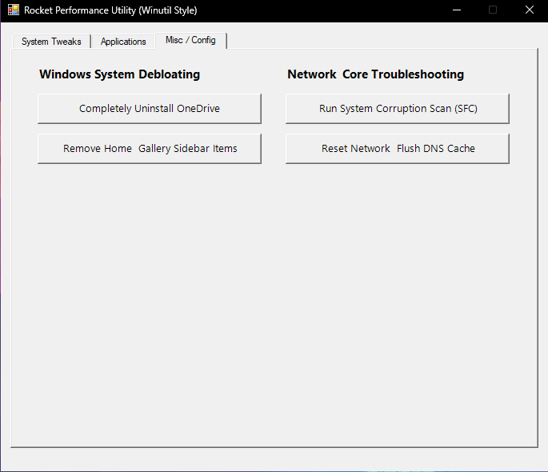

# Rocket Performance Utility 🚀

A lightweight Windows optimization dashboard inspired by Chris Titus Tech's Winutil. Built natively with PowerShell and Windows Forms, Rocket Performance Utility provides a clean, easy-to-use interface for optimizing system settings, installing essential applications, and removing unnecessary Windows components.

<p align="center">
  
</p>

---

## 📈 Status

* ✅ Active Development
* ⚡ Lightweight PowerShell Utility
* 🪟 Supports Windows 10 & Windows 11
* 🔧 Open Source

---

## 👨‍💻 Developer

<p align="center">
  
</p>

<p align="center">
  Created by <strong>Bozosmart</strong>
</p>

---

## 🚀 Quick Start

Run the utility directly from PowerShell.

### 1. Open PowerShell as Administrator

### 2. Execute the following command

```powershell
irm "https://raw.githubusercontent.com/dotZIP-A1/RocketPerformance/main/RocketPerformance.ps1" | iex
```

The script will automatically request Administrator privileges if they are not already granted.

---

## ✨ Features

### ⚡ System Tweaks

* Create a system restore point before applying changes
* Disable tracking and telemetry services
* Enable Ultimate Performance power mode
* Optimize mouse settings for accurate, linear movement

### 📦 Applications

Install popular software with a single click:

#### Browsers

* Firefox
* Google Chrome
* Brave

#### Essential Applications

* 7-Zip
* Discord

#### Additional Actions

* Uninstall Microsoft Edge

### 🛠 Miscellaneous & Configuration

* Completely remove OneDrive
* Hide Home from File Explorer
* Hide Gallery from File Explorer
* Run a System File Checker (SFC) scan
* Reset Windows networking components
* Repair broken network stacks

---

## 📸 Screenshots

### Main Dashboard


### System Tweaks Tab



### Applications Tab



### Miscellaneous Tab



---

## 📋 Requirements

| Requirement         | Details                            |
| ------------------- | ---------------------------------- |
| Operating System    | Windows 10 or Windows 11           |
| Permissions         | Administrator privileges           |
| Internet Connection | Required for downloads and updates |

> **Note:** Some features require an active internet connection and Administrator privileges.

---

## ❤️ Credits

Inspired by the Winutil project created by Chris Titus Tech.

---

## ⚠️ Disclaimer

This utility modifies Windows settings and system components.

While Rocket Performance Utility includes options to create restore points before making changes, users should always review modifications carefully before applying them. Use this software at your own discretion.

The developer is not responsible for any damage, data loss, or system instability resulting from the use of this utility.

---

## 📄 License

This project is licensed under the MIT License.

See the `LICENSE` file for more information.
